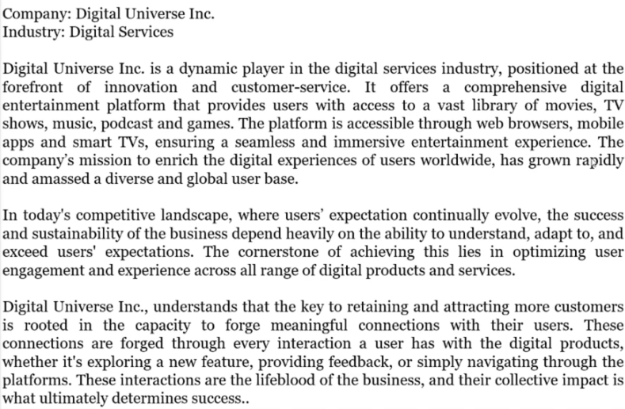

# Optimizing User Interactions for Supreme Engagement at Digital Universe Inc.

By leveraging Power BI to improve user engagement and experience by integrating, transforming, and visualizing diverse datasets, including user data and session records. I focused on analyzing user behavior to understand engagement patterns and preferences. 
This approach emphasized technical skills and the importance of translating data insights into actionable business recommendations. Through creating interactive dashboards, I demonstrated Power BI's exceptional capabilities in data integration and visualization, making it an indispensable tool for effective communication with stakeholders.

## Learning points
-	Use of Power BI in Behaviour Analytics

-	Product Analytics

-	User Analytics

-	Churn and Bounce rate

-	Data Modelling

-	Data Visualization

-	Reporting in Power BI

-	
## Overview
-	Rationale for the Project
-	Aim of the Project
-	Data Description
-	Tech Stack
-	Project Scope

## Business Introduction:

## Business Overview/Problem

Digital Universe Inc. faces a challenge in understanding how users interact with their digital products and services. They need to identify patterns, bottlenecks, and areas of improvement to optimize user engagement and experience. Without this understanding, the company risks losing customers to competitors and missing out on opportunities for growth.

Because these users’ interactions has become increasingly complex. The multitude of devices, platforms, and user preferences means that we are faced with a constant stream of data that is both vast and intricate. This presents us with several challenges:

A. User Interaction: The multitude of users needs to be studied and understood in terms of how they interact with the products and services of the company for better optimization.
 
B. User Diversity: Our user base is diverse, with varying preferences, needs, and behaviors. Understanding and catering to this diversity is crucial for ensuring a seamless user experience.
 
C. Continuous Improvement: We aim not only to meet but exceed user expectations continually. This requires a proactive approach to identifying areas for improvement.

## Rationale for the Project
User behavior analytics (UBA), is the process of gathering insight into the network events that users generate every day. This is essential in understanding user preferences, pain points, and behaviors. It helps Digital Universe Inc. make informed decisions to enhance user engagement and experience. By analyzing user interactions, the company can identify popular features, optimize user flows, and personalize content, ultimately leading to increased customer satisfaction and retention. 

Understanding User Needs and Preferences would help in:

 

A. Personalization: User behavior analytics allows Digital Universe Inc. to understand how individual users interact with their platform. By tracking interactions, they can personalize recommendations, content suggestions, and user experiences, catering to each user's specific preferences.
 
B. Segmentation: It helps in segmenting users into groups based on their behaviors, demographics, and preferences. This segmentation enables targeted marketing, content creation, and feature development for different user segments.
 
C. Improving Content Recommendations: By analyzing user interactions, such as views, clicks, and purchases, the company can gain insights into which content is the most popular and which content might need improvement or promotion. This data can be used to enhance content recommendation algorithms.

## Aim of the Project
The aim of this project is to leverage user behavior analysis to optimize user engagement and experience for Digital Universe Inc. By analyzing digital product interactions, the company seeks to identify areas for improvement, enhance user satisfaction, and ultimately increase customer retention and revenue.

Digital Universe Inc. seeks to harness the power of user behavior analysis to enhance digital products' engagement and overall user experience. By analyzing the way users interact with digital products, the company aims to:

A. Identify which type users bounced the most 
B. Understand what features and content resonate most with different user segments.
C. Tailor products and services to meet the unique preferences of various user groups.
D. Continuously improve their offerings based on real-time user feedback and data-driven insights.

## Data Description
Digital Universe Inc. has users' data stored in its database with the following components.

### User Profile Data
-	UserID: A unique identifier for each user.
-	Name: The name of the user.
-	Email: The email address associated with the user.
-	Age: The age of the user.
-	 Location: The geographical location or address of the user.
-	Sept_sub_type: The subscription type or plan that the user has for the month of September.
-	Recurring Logins: The number of times the user logged in during a specified period, often used to measure user engagement.
-	Aug_sub_type: The subscription type or plan that the user had for the month of August.
 
### Session Data

-	SessionID: A unique identifier for each session.
-	UserID: A unique identifier for the user associated with the session.
-	Date: The date when the session occurred.
-	Start Time: The time at which the session started.
-	 End Time: The time at which the session ended.
-	Duration: The length of time the session lasted, typically measured in minutes.
-	 Platform: The platform or application used for the session (e.g., website, mobile app).
-	 DeviceType: The type of device used for the session (e.g., laptop, mobile, tablet).
-	Channel: The acquisition channel of the user (social media, paid advertisement etc)
-	Rating: The user's rating or feedback related to the session or content.
-	Product Type: The category or type of product associated with the session (e.g music, games).
-	Detailed Product Type: A more specific subcategory or classification of the product.
-	Interaction Type: The type of interaction or engagement that occurred during the session (e.g., viewing, click, share&save).

## Tech Stack
-	Power BI: 
A  a data visualization and business intelligence tool that aids  in analysis by allowing users to transform raw data into meaningful insights and interactive reports. 

## Project Scope
A. Data Importation:  Import dataset from the data source.

 

B. Data Cleaning &Transformation: Clean and preprocess the data to handle missing values, duplicates, and outliers.

 

C. Data Modelling: Relationships between tables are defined based on common fields or keys (primary and foreign keys).

 

D. Data Analysis & User Segmentation: Analyze the data to gain initial insights and identify any correlations or patterns in the data. Segment users based on demographics, behavior, and feedback.

 

E. Data Visualization: Visualize user demographics, product interactions, and feedback trends.

 

F. Reporting and Recommendations: Generate actionable recommendations to optimize user engagement and experience. Create visual reports and dashboards using Power BI to present findings and insights.

## Insights and Recommendations

### Insights

-	Lagos is the location with the highest churn with Age Distribution 18-27 making up 14.77% of Churned Users. 
-	Users within the 28-37 age distribution churned the most in Nairobi.
-	5-52 minutes session duration had the highest total Total Sessions at 626. Above 196 minutes in session duration had the lowest Total Sessions at 543.
-	View in Duration Range 101-148 made up 6.50% of Total Sessions.
-	5-52 minutes in session duration had the highest average Total Sessions at 125.20. 
-	Above 196 had the lowest Total Sessions at 108.60.
-	Mobile App had the highest total Total Sessions at 1,564, followed by Website at 1021 and Smart TV at 415.
-	Music in Platform Mobile App made up 20.03% of Total Sessions.
-	Mobile App had the highest average Total Sessions at 312.80, followed by Website at 204.20 and Smart TV at 83.
-	Between Friday, September 1, 2023 and Saturday, September 30, 2023, Share & Save had the largest increase in Total Sessions (42.86%) while Search and Click tied for the largest decrease (14.29%).
-	The most recent Total Sessions anomaly was on Tuesday, September 19, 2023, when Search had a low of 5.
-	Total Sessions for Share & Save started trending up on Sunday, September 24, 2023, rising by 11.11% (1) in 6 days.
-	Rating (2.59% decrease) and Avg Session Duration (6.41% decrease) both trended down between Friday, September 1, 2023 and Saturday, September 30, 2023.
-	Avg Session Duration started trending down on Tuesday, September 19, 2023, falling by 7.47% (9.31) in 11 days.
-	Avg Session Duration dropped from 124.59 to 115.28 during its steepest decline between Tuesday, September 19, 2023 and Saturday, September 30, 2023.
-	There's no strong correlation between users session duration and rating.
-	Paid Advertisement had the highest total Total Sessions at 1,544, followed by Social Media at 922 and Organic Search at 534.
-	Paid Advertisement had the highest average Total Sessions at 308.80, followed by Social Media at 184.40 and Organic Search at 106.80.

### Recommendations
- Reach out to churned users with surveys or interviews to understand their reasons for downgrading or unsubscribing.
- Consider offering loyalty programs or discounts to users showing signs of potential churn.
- Enhance user onboarding and support to ensure users fully understand and utilize the platform's features.
- Invest more resources in popular product types to further enhance user engagement.
- Address any issues or concerns highlighted by lower user ratings.
- Consider using push notifications or reminders during identified low-activity periods to re-engage users.
- Tailor marketing campaigns and content to appeal to the primary demographics of the platform.
- Analyze any demographic-specific issues or concerns, and address them to improve user satisfaction and retention.
- Consider partnerships or collaborations that appeal to key demographic segments.

  ## LINK TO POWERBI REPORT:

  https://github.com/EngrIBGIT/Optimizing-User-Interactions-for-Supreme-Engagement-/blob/main/Optimizing_User_Interractions.pbix

